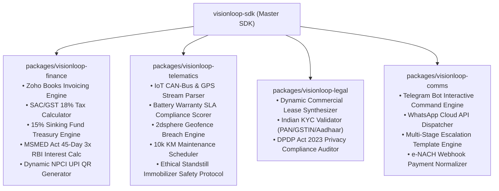

# Vision Loop — Intellectual Property & Modular Automation Assets
*Catalog of Proprietary Automation Engines, Reusable Libraries & Standalone IP Modules*

---

## 1. Vision Loop IP Strategy & Valuation Overview

All automation workflows developed for Vision Loop are engineered as **decoupled, modular, and reusable Python/TypeScript software packages**. Each module operates independently with zero tight coupling, allowing it to be:
1. **Imported directly into other ventures** (e.g., machinery rental, commercial real estate, SaaS billing, drone fleets, agritech leasing).
2. **Monetized as standalone developer SDKs / Micro-SaaS APIs**.
3. **Recognized as capitalized intangible IP assets** on the company’s balance sheet.

---

## 2. Reusable IP Asset Catalog



---

## 3. Module Breakdown & Cross-Project Applicability

| IP Module | Core Capabilities | Applicability to Other Projects |
| :--- | :--- | :--- |
| **`visionloop-finance`** | • Zoho Books OAuth & Invoice Automation<br>• SAC 997311 / 9966 GST Engine<br>• MSMED Act 3x RBI Compounding Interest<br>• 15% Treasury Sinking Fund Allocator<br>• Dynamic NPCI UPI QR Code String Generator | Any B2B business, subscription platform, consulting firm, or asset leasing venture operating in India. |
| **`visionloop-telematics`** | • CAN-Bus / OBD-II / GPS stream normalizer<br>• EV Battery Degradation & SLA Auditor<br>• High-speed geospatial geofencing<br>• Predictive maintenance trigger<br>• Standstill motor immobilizer protocol | EV delivery fleets, e-bikes, construction equipment, agricultural tractors, cold-chain transport. |
| **`visionloop-legal`** | • Markdown & PDF Lease Agreement Synthesis<br>• PAN/GSTIN Checksum & Verification Engine<br>• Aadhaar e-Sign audit trail builder<br>• DPDP Act 2023 data compliance checker | Commercial real estate leasing, co-working spaces, equipment rentals, SaaS corporate agreements. |
| **`visionloop-comms`** | • **Telegram Bot Command & Mobile Control Engine**<br>• WhatsApp Cloud API billing notices<br>• Dynamic conversational collection templates<br>• Omnichannel payment webhook listener | E-commerce collections, loan EMI reminders, subscription renewal alerts, field logistics messaging, remote IoT management bots. |
| **`visionloop-sdk`** | • Unified client wrapping all 4 engines into a single, cohesive developer API | Unified corporate backbone for multi-subsidiary enterprise operations. |

---

## 4. Package Installation & Portability Guide

Any automation can be installed into any external project via standard `pip`:

```bash
# Install individual modular engines
pip install ./packages/visionloop-finance
pip install ./packages/visionloop-telematics
pip install ./packages/visionloop-legal
pip install ./packages/visionloop-comms

# Or install the unified master SDK
pip install ./packages/visionloop-sdk
```

---

## 5. Proprietary License & IP Ownership

All software libraries, automation algorithms, tax calculations, telematics protocols, and Telegram bot handlers contained in `packages/` are the proprietary Intellectual Property of **Vision Loop** and its Sole Proprietor.
