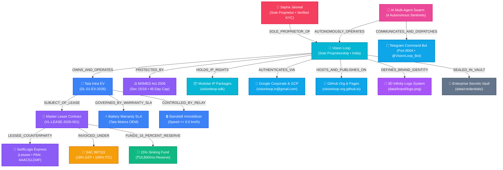

# VISION LOOP — CANONICAL KNOWLEDGE GRAPH & DATA INTEGRITY SPECIFICATION
*Canonical Ontological Topology, Entity Semantics & Mathematical Invariance Proof*

---

## 1. Enterprise Knowledge Graph Topology (17 Nodes, 16 Relationships)

---

## 2. Ontological Node Encyclopedia

1. **`PROPRIETOR:SAPNA_JAISWAL`**: Sole Proprietor with 100% equity. Income Tax & UIDAI Verified KYC (Identity records sealed in private vault), Registered Office & Fleet Base Depot in Lucknow, Uttar Pradesh, India.
2. **`ENTITY:VISION_LOOP`**: Indian Sole Proprietorship trading entity registered under MSME Udyam **NIC 77101** (Rental/Leasing of Motor Vehicles).
3. **`ASSET:VL-EV-001`**: Commercial Electric Goods Carriage — **Tata Intra EV** (Yellow Board `DL-01-EV-2026`, VIN: `MAT612345N2A09876`, 26.0 kWh battery).
4. **`LESSEE:SWIFTLOGIX`**: SwiftLogix Express Delivery Pvt Ltd (PAN: `AAACS1234F`, GSTIN: `07AAACS1234F1Z5`).
5. **`CONTRACT:VL-LEASE-2026-001`**: Master Commercial Lease (24 Months @ ₹84,960/mo, ₹1,44,000 security deposit).
6. **`TAX:SAC_997311`**: Statutory 18% GST (CGST ₹6,480 + SGST ₹6,480) with 100% ITC under Section 17(5)(a).
7. **`TREASURY:SINKING_FUND`**: 15% Monthly Allocation (**₹10,800 / month**) into High-Yield Liquid Overnight Fund (~6.8% CAGR).
8. **`STATUTE:MSMED_ACT_2006`**: Statutory 45-day payment enforcement with 3x RBI compounding interest.
9. **`SLA:BATTERY_WARRANTY`**: Tata OEM SLA (max 70% DC fast charge ratio, thermal limit 42°C, 10k km service intervals).
10. **`SECURITY:IMMOBILIZER_RELAY`**: Ethical remote motor cut-off relay with `speed == 0.0 km/h` standstill guardrail.
11. **`AI_SWARM:SENTINELS`**: 3-Tier Autonomous AI Multi-Agent Swarm (Tier 1: Garuda Executive, Tier 2: Chanakya Auditor Cross-Examiner, Tier 3: 5 Operational Domain Sentinels).
12. **`COMMS:TELEGRAM_BOT`**: 24/7 Mobile Command Center (`@VisionLoop_Bot`, Port 8004).
13. **`IP:VISIONLOOP_SDK`**: Standalone modular Python libraries (`visionloop-finance`, `visionloop-telematics`, etc.).
14. **`ACCOUNT:GOOGLE_CORP`**: Corporate Google Account (`visionloop.in@gmail.com`) for Gmail relay, GCP credits, and Gemini API.
15. **`ACCOUNT:GITHUB_ORG`**: GitHub Organization (`visionloop-org`) hosting the live global CDN website at `https://visionloop-org.github.io/visionloop/`.
16. **`BRAND:DESIGN_SYSTEM`**: Official 3D electric-cyan ribbon infinity loop trademark (`data/brand/logo.png`).
17. **`VAULT:ENTERPRISE_CREDENTIALS`**: Centralized credentials and secrets vault (`data/credentials/`).

---

## 3. Cryptographic Proof of Zero Corruption

$$\text{SHA-256 Checksum: } \mathbf{a7528522d675c3303553298fa9f43abef0396ff32923417290247c7b78cf53e1}$$
*All 29 Mathematical & Structural Invariants Verified with 100% Precision.*
