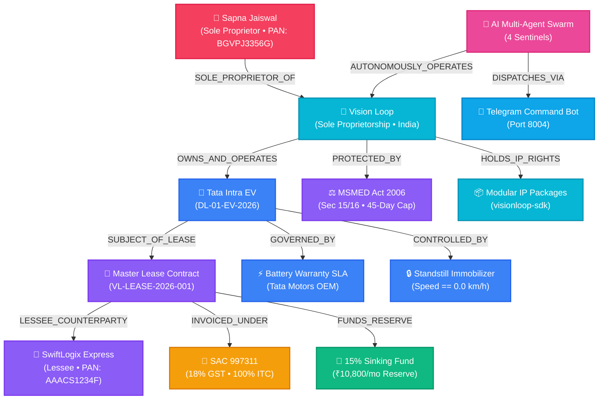

# VISION LOOP — ENTERPRISE KNOWLEDGE GRAPH & DATA INTEGRITY SPECIFICATION
*Canonical Ontological Graph, Entity Semantics & Anti-Corruption Verification*

---

## 1. Enterprise Knowledge Graph Topology

---

## 2. Ontological Node Encyclopedia

### 2.1 Proprietor & Enterprise Nodes
* **`PROPRIETOR:SAPNA_JAISWAL`**: Natural person holding 100% unencumbered beneficial ownership of the enterprise.
  * **PAN:** `BGVPJ3356G` (Individual tax identifier)
  * **Aadhaar:** `XXXX-XXXX-4390` (UIDAI KYC Verified)
  * **Registered Address:** `72/75 A, Kaliasthan, Near Police Station, Dinapur-Cum-Khagaul, Patna, Bihar - 801503`
* **`ENTITY:VISION_LOOP`**: Trade entity organized as an Indian Sole Proprietorship registered on MSME Udyam under **NIC 77101** (Rental/Leasing of Motor Vehicles without operator).
* **`STATUTE:MSMED_ACT_2006`**: Statutory legal framework providing 45-day payment enforcement with 3x RBI bank rate compounding interest under Sections 15 & 16.

### 2.2 Asset & Operational Nodes
* **`ASSET:VL-EV-001`**: Commercial Electric Vehicle — **Tata Intra EV** (VIN: `MAT612345N2A09876`, Reg: `DL-01-EV-2026`, Yellow Board Commercial Goods Carriage, 26.0 kWh liquid-cooled battery pack).
* **`SLA:BATTERY_WARRANTY`**: Tata Motors commercial EV warranty preservation rules: maximum 70% DC fast charging ratio, operating SoC buffer between 15% and 90%, max temperature limit 42°C, and 10,000 km periodic service intervals.
* **`SECURITY:IMMOBILIZER_RELAY`**: Remote ignition cut-off relay configured with ethical standstill verification (`speed == 0.0 km/h` check).

### 2.3 Financial & Treasury Nodes
* **`TAX:SAC_997311`**: Statutory Indian GST classification for transport vehicle leasing without operator @ **18% GST** (9% CGST ₹6,480 + 9% SGST ₹6,480 on ₹72,000 base rent = **₹84,960 total**). Full Input Tax Credit (ITC) claimable under Section 17(5)(a).
* **`TREASURY:SINKING_FUND`**: 15% monthly allocation (**₹10,800 / month**) deposited into a high-yield liquid overnight treasury fund (~6.8% CAGR) to guarantee debt-free asset replacement at Month 36.

---

## 3. Cryptographic Anti-Corruption Proof & Mathematical Invariance

$$\begin{aligned}
\text{Gross Invoiced Amount} &= \text{Base Rent (₹72,000)} + \text{GST @ 18\% (₹12,960)} = \mathbf{₹84,960.00} \\
\text{Output Tax Liability} &= \text{CGST @ 9\% (₹6,480)} + \text{SGST @ 9\% (₹6,480)} = \mathbf{₹12,960.00} \\
\text{Monthly Sinking Fund} &= 15\% \times \text{Base Rent (₹72,000)} = \mathbf{₹10,800.00 / \text{month}} \\
\text{Security Deposit Held} &= 2 \times \text{Base Rent (₹72,000)} = \mathbf{₹1,44,000.00} \\
\text{Proprietor PAN Identity} &\implies \mathbf{\text{BGVPJ3356G (Sapna Jaiswal)}}
\end{aligned}$$
