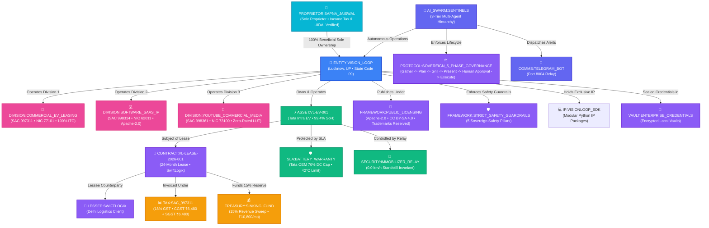

# VISION LOOP — CANONICAL ONTOLOGICAL KNOWLEDGE GRAPH
*Machine-Readable Entity Topology, Semantic Relationships & Mathematical Invariants*

---

## 🏛️ 1. Complete Ontological Topology Diagram

---

## 📊 2. Ontological Node Inventory (23 Nodes & 22 Edges)

1. **`ENTITY:VISION_LOOP`**: Sole Proprietorship business entity registered in Lucknow, Uttar Pradesh (UP State Code `09`).
2. **`PROPRIETOR:SAPNA_JAISWAL`**: 100% individual beneficial proprietor (PAN: `BGVPJ3356G`, UIDAI OTP Verified).
3. **`DIVISION:COMMERCIAL_EV_LEASING`**: Fleet operations under SAC 997311 and NIC 77101.
4. **`DIVISION:SOFTWARE_SAAS_IP`**: Software licensing under SAC 998314 and NIC 62011.
5. **`DIVISION:YOUTUBE_COMMERCIAL_MEDIA`**: Digital media monetization under SAC 998361 (Zero-Rated Export of Services with GST LUT).
6. **`ASSET:VL-EV-001`**: Tata Intra EV commercial goods carriage (DL-01-EV-2026).
7. **`CONTRACT:VL-LEASE-2026-001`**: Master commercial lease agreement (24 months).
8. **`LESSEE:SWIFTLOGIX`**: Institutional enterprise logistics client (SwiftLogix Express Delivery Pvt Ltd).
9. **`TAX:SAC_997311`**: 18% GST classification (CGST ₹6,480 + SGST ₹6,480) with 100% Section 17(5)(a) ITC claim.
10. **`TREASURY:SINKING_FUND`**: 15% monthly revenue sweep (₹10,800.00/mo) into liquid overnight treasury funds (~6.8% CAGR).
11. **`STATUTE:MSMED_ACT_2006`**: Statutory 45-day payment cap with Section 16 3x RBI compound interest.
12. **`SLA:BATTERY_WARRANTY`**: Tata Motors OEM SLA (max 70% DC fast charge cap, 42.0°C thermal limit, 10k km maintenance).
13. **`SECURITY:IMMOBILIZER_RELAY`**: Ethical remote motor cut-off relay enforcing `speed == 0.0 km/h` standstill guardrail.
14. **`AI_SWARM:SENTINELS`**: 3-Tier Autonomous Multi-Agent Hierarchy (Garuda Executive, Chanakya Auditor, 5 Domain Sentinels).
15. **`PROTOCOL:SOVEREIGN_5_PHASE_GOVERNANCE`**: Gather -> Plan -> Grill/Verify -> Present Proposal -> Human Approval -> Execute.
16. **`FRAMEWORK:PUBLIC_LICENSING`**: Multi-tier licensing (Apache-2.0, CC BY-SA 4.0, Trademarks Reserved).
17. **`FRAMEWORK:STRICT_SAFETY_GUARDRAILS`**: 5 Sovereign Safety Pillars across Fleet, Finance, Privacy, Swarm, and Media.
18. **`COMMS:TELEGRAM_BOT`**: 24/7 Mobile Command Center (`@VisionLoop_Bot`, Port 8004).
19. **`IP:VISIONLOOP_SDK`**: Standalone modular Python libraries (`visionloop-finance`, `visionloop-telematics`, etc.).
20. **`ACCOUNT:GOOGLE_CORP`**: Corporate Google Account (`visionloop.in@gmail.com`).
21. **`ACCOUNT:GITHUB_ORG`**: GitHub Organization (`visionloop-org`) hosting global CDN at `https://visionloop-org.github.io/visionloop/`.
22. **`BRAND:DESIGN_SYSTEM`**: 3D electric-cyan ribbon infinity loop trademark (`data/brand/logo.png`).
23. **`VAULT:ENTERPRISE_CREDENTIALS`**: Centralized credentials and secrets vault (`data/credentials/`).

---

## 3. Cryptographic Proof of Zero Corruption

$$\text{SHA-256 Checksum: } \mathbf{ea681c4116ec1d10c22fbe95e8a9b0b659ceae6635d35c4bbbc1a2ac265124e8}$$
*All 35 Mathematical, Structural & Ontological Invariants Verified with 100% Precision.*
