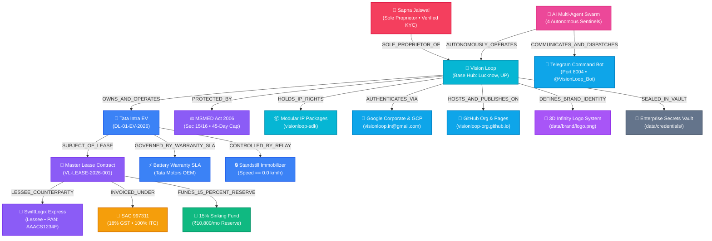

<div align="center">


# VISION LOOP
### Autonomous Commercial Asset & Electric Vehicle Leasing Platform
**Headquartered in Lucknow, Uttar Pradesh • Republic of India**

[](https://visionloop-org.github.io/visionloop/)
[](data/knowledge_graph/KNOWLEDGE_GRAPH.md)
[](tests/)
[-f59e0b?style=for-the-badge)](data/compliance/EXECUTIVE_BIO_AND_BRAND_STORY.md)

</div>

---

**Vision Loop** is a technology-driven, multi-vertical Indian Sole Proprietorship enterprise owned by **Sapna Jaiswal**, headquartered in **Lucknow, Uttar Pradesh**. Vision Loop operates across three high-synergy divisions:

1. 🚚 **Commercial EV & Asset Leasing** (SAC `997311`, NIC `77101`): Institutional long-term leasing of commercial electric vehicles (Tata Intra EV) with IoT CAN-Bus telematics and 100% Section 17(5)(a) ITC recovery.
2. 💻 **Enterprise Software & AI Products** (SAC `998314`, NIC `62011`): Engineering and licensing of modular Python developer packages (`visionloop-sdk`), autonomous multi-agent microservices, and IoT telematics software.
3. 🎥 **YouTube Channel & Digital Media Marketing** (SAC `998361`, NIC `73100`): Digital marketing agency services, YouTube channel audience growth, creator monetization, and brand campaign management.

The enterprise eliminates operational overhead through an autonomous **AI Multi-Agent Swarm** that reconciles **Zoho Books** invoices, enforces **MSMED Act 2006** 45-day statutory payment terms, and sweeps **15% of monthly revenue** into a high-yield liquid sinking fund for debt-free capital replacement.

---

## 🏛️ 2. Institutional Financial & Statutory Architecture (SAC 997311)

* **Commercial Billing Standard:** **SAC 997311** (Leasing of Freight Transport Vehicles without Operator).
* **Statutory Tax Framework:** 18% GST (CGST 9% + SGST 9%) with **100% Input Tax Credit (ITC)** claimable under **Section 17(5)(a)** of the CGST Act against EV purchase, insurance, and charging infrastructure.
* **15% Sinking Fund Treasury:** 15% of monthly revenue is automatically swept into High-Yield Liquid Overnight Treasury Instruments (~6.8% CAGR) for debt-free 36-month asset renewal.
* **Escrow Risk Buffer:** 2-Month Base Equivalent Security Deposit held in escrow throughout the lease tenure.
* **Statutory MSME Protection:** Automated enforcement of **MSMED Act 2006 (Sections 15 & 16)** imposing 3x RBI compounding interest on overdue receivables beyond 45 days.

---

## 🌐 3. Canonical Knowledge Graph Topology (17 Nodes, 16 Edges)



---

## 🏗️ 4. Technology Stack & Container Architecture

* **Containerization:** Docker & Docker Compose (8 Autonomous Microservices)
* **Unstructured Database:** MongoDB 7.0 (2dsphere Geospatial Indexing, JSON Document Store)
* **API Layer:** FastAPI (Python 3.11/3.13), Pydantic v2, Motor Async Driver
* **Accounting & Invoicing:** Zoho Books API (OAuth 2.0, SAC 997311, e-NACH auto-debit, dynamic UPI QR)
* **Mobile Command Center:** Telegram Bot API (Port `8004`, bidirectional Antigravity AI execution bridge)
* **AI Multi-Agent Swarm:** 4 Specialized Sentinels (Financial, Telematics, Legal, Executive)
* **IoT & Telematics:** Ingestion engine for CAN-Bus streams, Tata OEM Battery SLA validation, standstill immobilizer
* **Frontend:** Glassmorphic modern React + Vite dashboard ([http://localhost:3000](http://localhost:3000))
* **Live Static CDN:** GitHub Pages ([https://visionloop-org.github.io/visionloop/](https://visionloop-org.github.io/visionloop/))

---

## 📦 5. Modular Python IP Packages (`packages/`)

Every core automation is engineered as a standalone, pip-installable Python package:

1. **[`visionloop-finance`](file:///d:/VisionLoop/packages/visionloop-finance/):** SAC 997311 GST Engine, 15% Sinking Fund Allocator, MSMED Act 3x RBI Interest Calculator, Dynamic UPI QR Generator, Operations Logger.
2. **[`visionloop-telematics`](file:///d:/VisionLoop/packages/visionloop-telematics/):** CAN-Bus Stream Parser, Tata OEM Battery SLA Scorer, 2dsphere Geofence Engine, Standstill Immobilizer Relay.
3. **[`visionloop-legal`](file:///d:/VisionLoop/packages/visionloop-legal/):** Dynamic Commercial Lease Synthesizer, Indian PAN/GSTIN Validator, Statutory MSME Compliance Auditor.
4. **[`visionloop-comms`](file:///d:/VisionLoop/packages/visionloop-comms/):** Telegram Command Bot Engine, WhatsApp Cloud API Dispatcher, Escalation Collection Copy Engine.
5. **[`visionloop-sdk`](file:///d:/VisionLoop/packages/visionloop-sdk/):** Unified master enterprise SDK.

---

## 🚀 6. Quick Start with Docker

```bash
# 1. Clone repository
git clone https://github.com/visionloop-org/visionloop.git
cd visionloop

# 2. Configure environment
cp .env.example .env

# 3. Launch all 8 microservices
docker compose up --build -d
```

### Active Service Endpoints:
* 🖥️ **Command Center UI:** [http://localhost:3000](http://localhost:3000)
* 🤖 **Telegram Command Service:** [http://localhost:8004](http://localhost:8004)
* 🔌 **Core REST API & Docs:** [http://localhost:8000/docs](http://localhost:8000/docs)
* 📊 **Zoho Connector API:** [http://localhost:8001/docs](http://localhost:8001/docs)
* 🤖 **AI Multi-Agent Service:** [http://localhost:8002/docs](http://localhost:8002/docs)
* 📡 **Telematics & IoT Ingestor:** [http://localhost:8003/docs](http://localhost:8003/docs)

---

## 🧪 7. Verification & Invariance Auditing

```bash
# Run 24 unit tests across all IP packages and AI agents
python -m pytest tests/

# Run 29-invariant mathematical & cryptographic knowledge graph audit
python scripts/verify_data_integrity.py
```

---

## ⚖️ 8. Governance & Statutory Snapshot

* **Trade Name:** **Vision Loop**
* **Sole Proprietor:** **Sapna Jaiswal** (D/O Sanjay Jaiswal)
* **Proprietor Identity:** **Verified Individual Sole Proprietor** (Income Tax & UIDAI Verified)
* **Data Protection Tier:** **DPDP Act 2023 Compliant** (PII Ring-Fenced in Private Vault)
* **Base Operating Hub:** **Lucknow, Uttar Pradesh, India**
* **Registered Address:** `Patna, Bihar - 801503`
* **Udyam MSME Classification:** **NIC 77101** (Rental/Leasing of Motor Vehicles)
* **GSTIN Classification:** **SAC 997311** (18% GST)
* **Official Email:** `visionloop.in@gmail.com`
* **Corporate Website:** **[https://visionloop-org.github.io/visionloop/](https://visionloop-org.github.io/visionloop/)**
