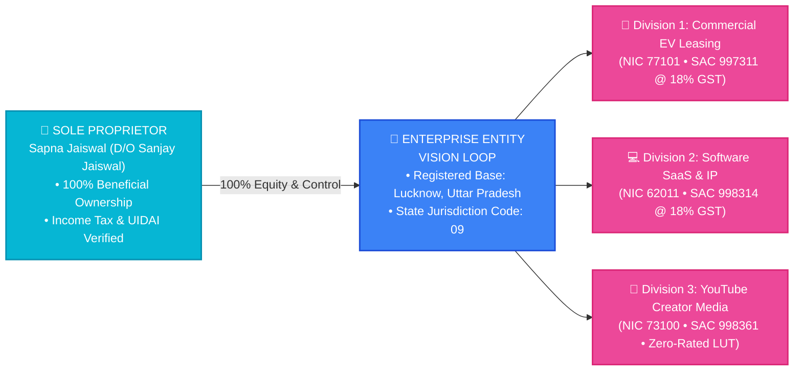
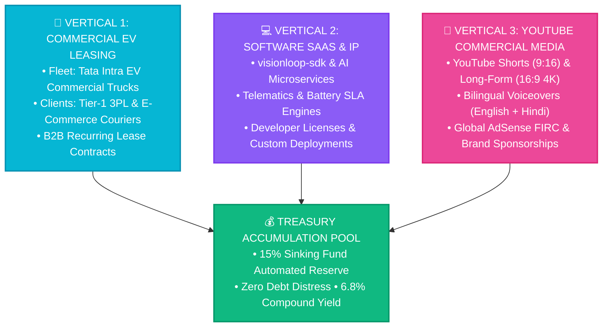
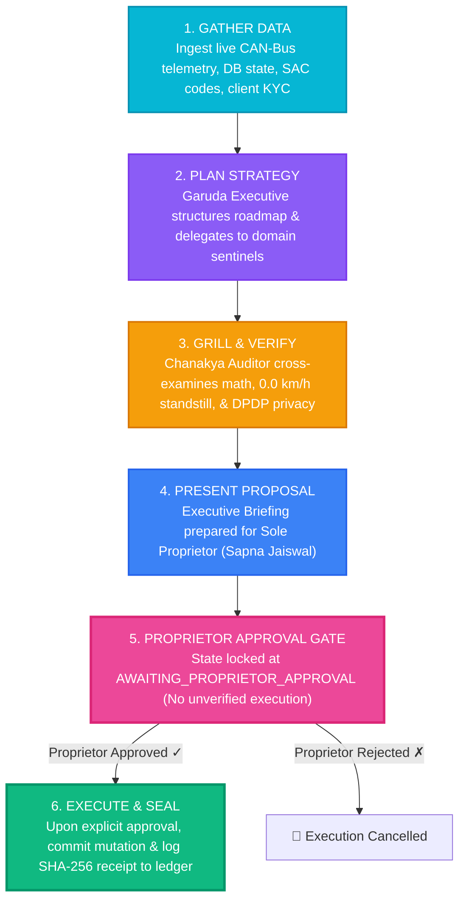

# VISION LOOP — MASTER BUSINESS MODEL & PROCESS ARCHITECTURE
*Comprehensive Enterprise Blueprint: Statutory Identity, 3 Synergy Verticals, Unit Economics & Autonomous Swarm Operations*

---

## 🏛️ 1. Corporate Identity & Legal Sovereignty

* **Legal Form:** Sole Proprietorship registered in the Republic of India.
* **Sole Proprietor:** **Sapna Jaiswal** (Father: Sanjay Jaiswal).
* **Principal Headquarters:** Lucknow Logistics Hub, Uttar Pradesh (UP State Code `09`).
* **Operating Freight Corridors:** Lucknow – Kanpur – Delhi NCR Commercial Expressways.
* **Registered Office Premises:** Spousal Consent Premises under executed **[`NO_OBJECTION_CERTIFICATE_PREMISES_NOC.md`](file:///d:/VisionLoop/data/legal/NO_OBJECTION_CERTIFICATE_PREMISES_NOC.md)**.

---

## 💼 2. The 3 Interlocking Synergy Verticals

### Vertical 1: Commercial EV & Asset Leasing
* **Core Product:** Institutional 24–36 month full-service leases of commercial goods carriages (Tata Intra EV).
* **Tax Code:** **SAC 997311** (18% GST).
* **Statutory Benefit:** Clients claim **100% Input Tax Credit (ITC)** under **Section 17(5)(a)** of the CGST Act against goods vehicle acquisition, battery charging, and insurance.

### Vertical 2: Software SaaS & Proprietary Python IP
* **Core Product:** Institutional SDK licenses (`visionloop-sdk`), CAN-Bus battery warranty scoring APIs, and automated MSMED Act debt collection engines.
* **Tax Code:** **SAC 998314** (18% GST) / MSME NIC 62011.
* **Distribution:** Open-core Apache-2.0 libraries on GitHub with enterprise support.

### Vertical 3: YouTube Commercial Channel & Digital Media
* **Core Product:** YouTube video series detailing commercial EV operations, battery tech, and autonomous AI swarms.
* **Tax Treatment:** **SAC 998361** — **Zero-Rated Export of Services** with active GST Letter of Undertaking (**LUT**).
* **Banking:** Direct USD wire remittance from Google LLC (USA) with Foreign Inward Remittance Certificates (**FIRC**).

---

## 📈 3. Unit Economics & Mathematical Invariance

| Operational Metric | Formula / Exact Rule | Monthly Unit Value (INR) |
| :--- | :--- | :--- |
| **Base Vehicle Lease Rate** | Negotiated Institutional Rate | **₹72,000.00** |
| **Intra-State CGST (9.0%)** | $\text{Base} \times 0.09$ | **₹6,480.00** |
| **Intra-State SGST (9.0%)** | $\text{Base} \times 0.09$ | **₹6,480.00** |
| **Total Monthly Invoiced (GSTIN)** | $\text{Base} + \text{CGST} + \text{SGST}$ | **₹84,960.00** |
| **15% Sinking Fund Sweep** | $\text{Base} \times 0.15000$ (Segregated Reserve) | **₹10,800.00 / month** |
| **Security Deposit Escrow** | $2.0 \times \text{Base Rent}$ (Held in liquid escrow) | **₹1,44,000.00** |
| **Month 36 Replacement Pool** | Cumulative Sinking Fund + ~6.8% CAGR Yield | **₹4,29,840.00** *(Debt-Free Asset Replacement)* |

---

## 🔄 4. The Sovereign 5-Phase Operational Lifecycle

---

## 🛡️ 5. Strict Safety Guardrails & Zero-Corruption Guarantees

1. 🛑 **0.0 km/h Standstill Invariant:** The remote immobilizer relay cannot actuate unless vehicle velocity is verified at $0.0\text{ km/h}$ for $\ge 3$ consecutive CAN-Bus frames.
2. 🔋 **Tata OEM 70% DC Fast Charge Cap:** Lifetime DC fast charging capped at $\le 70\%$, thermal limit at $42.0^\circ\text{C}$, SoC buffer at $15\% - 90\%$.
3. 🔒 **DPDP Act 2023 Redaction Wall:** Raw PAN (`BGVPJ3356G`) and Aadhaar numbers sealed in private vaults; public channels display verified badges only.
4. ⚖️ **MSMED Act 2006 Statutory Protection:** Statutory 45-day payment terms with automated Section 16 3x RBI compound interest escalation.
5. 🔐 **Cryptographic Proof of Invariance:** Every ontological node, edge, and financial equation is validated by automated CI/CD audits against SHA-256 checksums.
