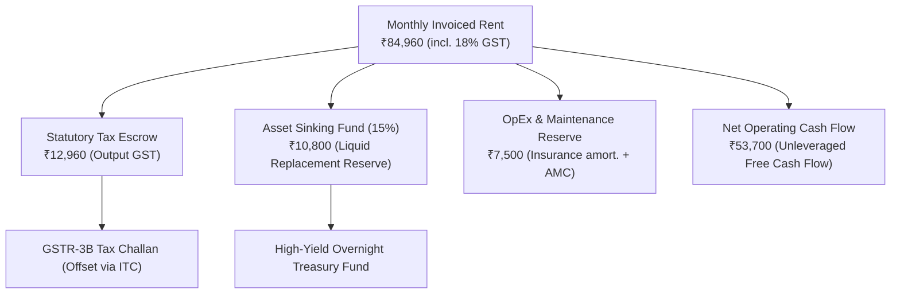

# VISION LOOP — STANDARD OPERATING PROCEDURES & BUSINESS BEST PRACTICES
*(Institutional-Grade Governance, Risk Management & Treasury Blueprint for Commercial EV Leasing)*

---

## 1. Executive Governance & Corporate Philosophy

Vision Loop adheres to the highest standards of **commercial ethics, fiduciary discipline, asset longevity optimization, and statutory compliance**. Operating as an automated Sole Proprietorship in India, the business implements institutional risk management safeguards across Treasury, Operations, OEM Warranties, and Client Success.

---

## 2. Treasury & Financial Prudence Best Practices

### 2.1 The 15% Sinking Fund (Asset Replacement Reserve)
* **Principle:** Commercial vehicles and EV battery packs experience operational depreciation over 3–5 years.
* **Implementation:** 15% of gross monthly rental (**₹10,800 / month / asset**) is autonomously transferred to a dedicated high-yield liquid overnight fund.
* **Objective:** Guarantees full capital accumulation to procure the next-generation commercial asset or replace battery packs at year 4 with zero external debt distress.

### 2.2 Input Tax Credit (ITC) 2B Matching Protocol
* **Strict Rule:** Never claim unverified ITC. All supplier invoices (Tata Motors AMC, FastTag recharges, commercial charging, insurance) are matched against **GSTR-2B** on the 14th of every month before filing GSTR-3B.
* **Benefit:** 100% compliant tax filing, zero interest liabilities under Section 50 of CGST Act.

### 2.3 Security Deposit Escrow & Lien Marking
* **Principle:** Client security deposits (**2 months rent = ₹1,44,000**) are never mingled with operating expenses.
* **Implementation:** Deposits are parked in bank fixed deposits with interest accruing or held in ring-fenced escrow accounts, protecting the proprietor's liquidity while ensuring instant refundability upon amicable contract conclusion.

---

## 3. Asset Protection & OEM Battery Preservation Protocol

Commercial EV battery lifespan directly determines asset residual value and long-term enterprise valuation.

| Battery Preservation Rule | Standard Operating Procedure | Automated AI Sentinel Action |
| :--- | :--- | :--- |
| **SoC Operating Buffer** | Keep battery State of Charge between **15% and 90%** during daily cycles. | Warning dispatched if vehicle drops below 15% SoC without active navigation to charger. |
| **Fast vs Slow Charging Ratio** | Maximum **70% DC Fast Charging** vs **30% AC Slow Overnight Charging**. | AI Telematics Sentinel monitors charging logs; prompts lessee to perform balancing AC charge. |
| **Thermal Protection** | Avoid operating or fast-charging when pack temperature exceeds **42°C**. | Real-time CAN-Bus temperature trigger engages active cooling alert and driver notification. |
| **OEM 10,000 KM Servicing** | Strictly serviced at Tata Motors Commercial Authorized EV Hubs. | Automatic service booking created at 9,500 km milestone. |
| **Tyre & Alignment Audit** | Bi-monthly pressure (50 PSI commercial) and rotation inspection. | Prevents uneven tread wear and maximizes range efficiency (kWh/km). |

---

## 4. Legal, Statutory & Dispute Mitigation Best Practices

### 4.1 MSMED Act 45-Day Statutory Protection
* Under **Section 15 & 16 of the Micro, Small and Medium Enterprises Development (MSMED) Act, 2006**, all corporate lessees are legally mandated to settle invoices within a maximum of **45 days**.
* Delayed payments attract mandatory compound interest at **3 times the RBI Bank Rate**.
* Vision Loop’s Zoho Books invoices automatically print MSMED statutory protection notices, ensuring rapid corporate settlement priority.

### 4.2 Traffic Violations & Parivahan Challan Pass-Through
* Commercial vehicles operating in metropolitan corridors inevitably incur occasional automated camera challans (speeding, lane violations, red lights).
* **Policy:** Vision Loop Core monitors the RTO Parivahan portal daily. Any challan issued during the active lease period is automatically appended to the lessee's monthly billing statement with the official digital challan receipt attached.

### 4.3 Safe & Ethical Remote Immobilization Protocol
To balance creditor protection with human safety:
1. **Stage 1 (Due Date + 2 Days):** Friendly conversational WhatsApp & Email reminder with UPI QR link.
2. **Stage 2 (Due Date + 5 Days):** Formal Notice of Default with late fee interest alert.
3. **Stage 3 (Due Date + 8 Days):** Final Demand Notice granting 48 hours cure period.
4. **Stage 4 (Standstill Execution Only):** Immobilization relay triggers **strictly when the vehicle speed is 0.0 km/h (engine off in a stationary position)**. The system **NEVER** interrupts motor power while the vehicle is in motion.

### 4.4 Data Protection & DPDP Act 2023 Compliance
* In accordance with India’s **Digital Personal Data Protection Act, 2023**:
  * Driver and lessee personal identifiable information (PII) is encrypted at rest and in transit.
  * Telemetry data is utilized exclusively for asset safety, maintenance, and insurance fulfillment.

---

## 5. Client Success & Operational Continuity (SLA)

1. **Uptime Guarantee:** Vision Loop targets **98.5% asset operational uptime**.
2. **Scheduled Maintenance Window:** Maintenance is coordinated over weekends or low-demand logistics hours (Sundays or night shifts).
3. **Transparent Digital Portal:** Lessees receive read-only dashboard access to monitor real-time vehicle range, charging logs, past tax invoices, and payment receipts.
4. **Emergency Roadside Assistance (RSA):** 24/7 dedicated RSA coverage across the authorized operating perimeter through Tata Motors OEM fleet assist.
