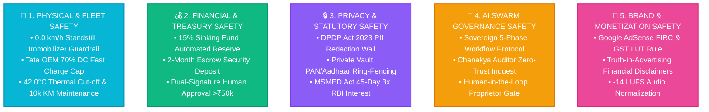

# VISION LOOP — STRICT ENTERPRISE SAFETY & OPERATIONAL SECURITY PROTOCOLS
*Comprehensive Multi-Layer Safety Guardrails, Physical Telematics Lockouts, Financial Ring-Fencing & AI Swarm Governance*

---

## 🏛️ Executive Summary & The 5 Sovereign Safety Pillars

Vision Loop operates under an absolute zero-tolerance safety framework. All autonomous systems, telematics relays, financial algorithms, and AI swarm agents are governed by deterministic cryptographic and mechanical guardrails.

---

## 🚚 1. Physical Fleet & CAN-Bus Telematics Safety Protocols

### Protocol 1.1: Ethical Standstill Immobilizer Relay Guardrail (Zero Moving Cut-off)
* **RULE:** The remote starter cut-off relay **MUST NEVER** be actuated while the vehicle is in motion.
* **Mechanical Invariant:**
  $$\text{Immobilizer Status} = \begin{cases} \text{PERMITTED} & \text{if } v = 0.0\text{ km/h for } \ge 3 \text{ consecutive CAN-Bus frames} \\ \text{HARD LOCKOUT} & \text{if } v > 0.0\text{ km/h} \end{cases}$$
* **Staged Escalation:**
  1. *Warning Phase (Day 1–3 past default):* Push notifications via WhatsApp & Telegram. Vehicle operates normally.
  2. *Audible In-Cab Alert (Day 4–6 past default):* Telematics chime sounds upon ignition.
  3. *Standstill Relay Arming (Day 7+ past default):* Relay arms **only after the vehicle comes to a complete halt ($0.0\text{ km/h}$) and transmission enters Park/Neutral**.

### Protocol 1.2: Tata Motors OEM Battery Warranty Preservation SLA
* **Max DC Fast Charge Ratio:** Strictly capped at **$\le 70\%$** of lifetime charge cycles. Minimum $30\%$ AC slow charging enforced.
* **Thermal Hard Cut-off:** If battery cell temperature exceeds **$42.0^\circ\text{C}$**, telematics automatically throttles fast-charging and alerts the base depot.
* **Operating SoC Buffer:** Recommended state of charge maintained between **$15\% \text{ and } 90\%$** to prevent cathode degradation.

### Protocol 1.3: Mandatory 10,000 KM Preventive Maintenance Safety Guardrail
* **Service Interval:** Every $10,000.0\text{ km}$.
* **Grace Buffer:** $+500\text{ km}$ (Service warning initiated at $9,500\text{ km}$).
* **Lockout Guardrail:** If unscheduled at $10,500\text{ km}$, maximum vehicle speed is electronically governed to $30\text{ km/h}$ until authorized Tata Motors service is logged.

---

## 💰 2. Financial & Treasury Safety Protocols

### Protocol 2.1: 15% Sinking Fund Automated Reserve Isolation
* **RULE:** Exactly **$15.000\%$** of monthly gross invoice revenue is swept automatically into a segregated liquid overnight treasury fund (~6.8% CAGR).
* **Capital Protection:** Sinking Fund assets can **never** be commingled with operational expenses or salary accounts.
* **Purpose:** Guarantees full cash replacement of vehicles by Month 36 with **zero debt distress or external loans**.

### Protocol 2.2: 2-Month Security Deposit Escrow Buffer
* Every lease contract requires a **2-Month Base Rental Escrow Deposit** (e.g., ₹1,44,000 on a ₹72k lease) held in liquid escrow to cushion against counterparty defaults.

### Protocol 2.3: Multi-Signature Approval Gateway (>₹50,000 Threshold)
* Any outward banking transaction, asset acquisition, or lease refund exceeding **₹50,000 INR** requires **explicit cryptographic authorization from the Sole Proprietor (Sapna Jaiswal)**. Autonomous AI agents cannot execute transactions above this limit alone.

---

## 🔒 3. Data Privacy & Statutory Compliance Protocols

### Protocol 3.1: DPDP Act 2023 Public PII Redaction Wall
* **MANDATORY LAW:** Government identity numbers (Proprietor PAN: `BGVPJ3356G`, Aadhaar 12-digit numbers, bank account numbers) **MUST NEVER** appear on public websites, GitHub repositories, video metadata, or public markdown documents.
* **Public Representation:** Public channels must display only verifiable badges:
  * `Verified Individual Sole Proprietor (Income Tax Verified)`
  * `UIDAI OTP Aadhaar Authenticated`
* **Private Vault Storage:** All raw identification documents are sealed in encrypted private vaults (`data/credentials/`, `data/kyc/`).

### Protocol 3.2: MSMED Act 2006 Statutory 45-Day Payment Ring-Fence
* Under **NIC 77101 (MSME Udyam)**, all B2B lease invoices carry statutory 45-day settlement caps.
* Invoices unpaid after Day 45 automatically accrue compound interest at **3x the RBI Bank Rate** under Section 16 of the MSMED Act 2006.

---

## 🤖 4. Autonomous AI Swarm Governance Safety Protocols

### Protocol 4.1: The Sovereign 5-Phase Human-in-the-Loop Protocol
The Swarm is mechanically constrained to follow this exact lifecycle for every operation:
1. **Phase 1: GATHER DATA** -> Ingest live telemetry, DB state, and statutory tax rules.
2. **Phase 2: PLAN STRATEGY** -> Chief Executive decomposes tasks and delegates to domain sentinels.
3. **Phase 3: GRILL & VERIFY** -> Chief Auditor cross-examines operational workers with tough mathematical and safety challenges.
4. **Phase 4: PRESENT PROPOSAL** -> Executive briefing synthesized for the Sole Proprietor. **Execution halts at `AWAITING_PROPRIETOR_APPROVAL`.**
5. **Phase 5: HUMAN APPROVAL & EXECUTE** -> Action executed **ONLY** after explicit proprietor sign-off.

### Protocol 4.2: Cryptographic Message Integrity (SHA-256 Hashing)
* Every message exchanged between swarm agents is hashed with SHA-256:
  $$\text{Hash} = \text{SHA-256}(\text{ID} \parallel \text{Sender} \parallel \text{Recipient} \parallel \text{Type} \parallel \text{Content} \parallel \text{Timestamp})$$
* Prevents hallucinated or unauthorized inter-agent command execution.

---

## 🎥 5. Digital Media & YouTube Brand Safety Protocols

### Protocol 5.1: Cross-Border AdSense GST LUT & FIRC Compliance
* All YouTube creator earnings from Google LLC (USA) are classified under **SAC 998361** as **Zero-Rated Export of Services**.
* Must be backed by:
  1. Active Letter of Undertaking (**LUT**) on the GST Portal.
  2. Form **W-8BEN** Indo-US DTAA 15% withholding treaty certification.
  3. Bank Foreign Inward Remittance Certificate (**FIRC**).

### Protocol 5.2: Truth-in-Advertising & Financial Transparency
* All published ROI claims, battery degradation statistics, and sinking fund compound growth charts must carry statutory disclaimers:
  * *"Past fleet performance and sinking fund CAGR yields are illustrative of institutional commercial leases."*

---

## 🚨 6. Emergency Incident Response Matrix (Kill Switches)

| Threat Scenario | Trigger Condition | Automated Safety Action | Emergency Contact |
| :--- | :--- | :--- | :--- |
| **High-Speed Vehicle Theft** | Geofence breach + velocity > 60 km/h outside Lucknow corridor | Alert UP Police & Lessee Admin; Arm immobilizer relay for next complete standstill | Lucknow Hub Operations Depot |
| **Thermal Battery Runaway** | Battery cell temperature $> 45.0^\circ\text{C}$ | Cut off motor torque electronically; Force hazard lights on; Notify base depot | Tata Motors Emergency Assist |
| **Unauthorized Bank Drawdown** | Attempted sweep $> ₹50,000$ without OTP | Freeze payment gateway token; Send urgent Telegram alert to Proprietor | ICICI Bank Corporate Helpline |
| **Data Breach / Public Leak** | Regex detection of PAN/Aadhaar in public git commit | Git pre-commit hook aborts commit; Purges memory cache; Triggers private vault lockdown | Vision Loop Legal Sentinel |
