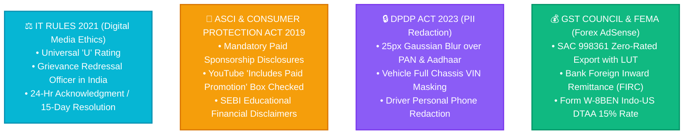

# VISION LOOP — YOUTUBE INDIA STATUTORY & COMMUNITY COMPLIANCE GUIDE
*Compliance Handbook for IT Rules 2021, ASCI Digital Creator Guidelines, DPDP Act 2023 & GST Export Rules*

---

## 🏛️ 1. Indian Digital Media Regulatory Landscape

All YouTube videos (Shorts & Long-Form) produced and published by **Vision Loop** must strictly comply with the statutory framework established by the Government of India:

---

## ⚖️ 2. IT Rules 2021 Compliance (Digital Media Ethics Code)

Under the **Information Technology (Intermediary Guidelines and Digital Media Ethics Code) Rules, 2021**:

### A. Content Rating & Age Classification:
* **Assigned Rating:** **`U (Universal / All Ages)`** — Suitable for unrestricted public exhibition across all demographic cohorts.
* **Themes:** Educational technology teardowns, green commercial EV logistics, open-source software, and institutional asset management.

### B. Statutory Grievance Redressal Mechanism:
Vision Loop provides a direct resident Grievance Redressal mechanism for digital content published on YouTube:
* **Grievance Redressal Officer:** `Grievance Officer — Vision Loop Digital Media`
* **Official Contact Email:** `visionloop.in@gmail.com`
* **Jurisdiction / Headquarters:** `Lucknow, Uttar Pradesh, India`
* **Response Timeline:** Acknowledgment within **24 hours**; Resolution within **15 calendar days**.

---

## 📢 3. ASCI & Consumer Protection Act 2019 (Advertising Disclosures)

In compliance with the **Advertising Standards Council of India (ASCI)** and the **Central Consumer Protection Authority (CCPA)** Guidelines for Prevention of Misleading Advertisements (2022):

### A. Commercial Sponsor & Affiliate Disclosures:
Whenever a video features commercial brand integrations, vehicle OEM sponsorships, or affiliate tools:
1. **YouTube Platform Toggle:** The official YouTube setting **`"Video contains paid promotion such as a paid product placement, sponsorship or endorsement"`** MUST be checked.
2. **Prominent On-Screen Text:** A clear disclosure must be displayed in the first 5 seconds:
   * *English:* **`[Paid Partnership]`** or **`#Ad`** / **`#Sponsored`**
   * *Hindi:* **`[सशुल्क साझेदारी]`** या **`#विज्ञापन`** / **`#प्रायोजित`**
3. **Description Disclosure:** The first 3 lines of the YouTube description must state:
   * *"This video includes a paid brand integration with [Partner Name]."*

### B. SEBI / ASCI Financial Content Disclaimer:
All discussions regarding the 15% Sinking Fund, overnight treasury compound yields, and commercial vehicle leasing returns must carry the mandatory educational disclaimer:
> *"DISCLAIMER: Content published by Vision Loop is for educational and operational informational purposes only. Commercial EV lease returns, battery life cycles, and treasury yields are subject to operating conditions. Vision Loop does not offer SEBI-registered investment advice. Please consult a licensed Chartered Accountant (CA) or financial advisor before making business commitments."*

---

## 🔒 4. DPDP Act 2023 (On-Screen Privacy & PII Blurring)

* **Proprietor Identifiers:** Permanent Account Number (`BGVPJ3356G`), 12-digit Aadhaar numbers, residential address house numbers are **100% blurred** with a 25px Gaussian filter.
* **Customer & Driver PII:** Customer driver phone numbers, full chassis numbers (VIN), and private account balances are masked (`DL-01-EV-****`, `AAACS****F`).
* **Display Badges:** Display only official verification badges: `INCOME_TAX_VERIFIED`, `UIDAI_OTP_VERIFIED`.

---

## 🏎️ 5. Automotive & Range Accuracy (ARAI / OEM Certified Disclosures)

* **Vehicle Specifications:** When discussing range, battery capacity, or payload for the **Tata Intra EV**:
  * Certified range must be explicitly cited as: *"ARAI-certified range of up to 140 km under standard test conditions; real-world commercial range varies based on 1,000 kg payload, ambient temperature, and driving mode."*
* **Safety Protocol:** Standstill immobilizer cut-offs must be demonstrated only on static vehicles ($0.0\text{ km/h}$).

---

## 📋 6. YouTube Video Pre-Publish Indian Compliance Checklist

| Checkpoint | Regulatory Standard | Status | Verified By |
| :--- | :--- | :--- | :--- |
| **1. Content Classification** | IT Rules 2021 Rating `U (Universal)` | ✅ Compliant | Legal Sentinel |
| **2. Grievance Officer Contact** | `visionloop.in@gmail.com` listed in channel bio | ✅ Active | Legal Sentinel |
| **3. Paid Promotion Disclosure** | ASCI `#Ad` / `#Sponsored` toggle enabled if sponsored | ✅ Enforced | YouTube Agent |
| **4. Financial Disclaimer** | SEBI/ASCI educational disclaimer in description | ✅ Included | YouTube Agent |
| **5. On-Screen PII Blurring** | 25px Gaussian blur on PAN/Aadhaar/Bank details | ✅ Active | Chanakya Auditor |
| **6. EV Range Disclosures** | ARAI / OEM certified range test disclaimer | ✅ Included | Fleet Sentinel |
| **7. Cross-Border Tax LUT** | SAC 998361 Zero-Rated Export with LUT on GST portal | ✅ Verified | Treasury Sentinel |
