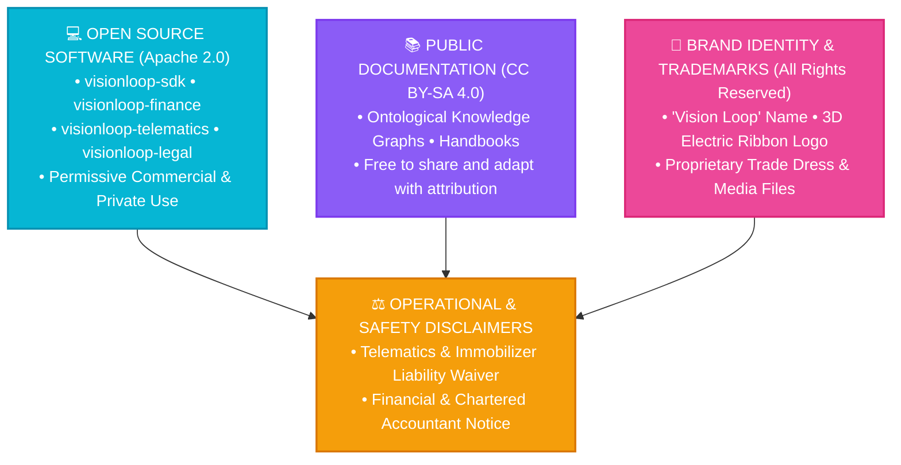

# VISION LOOP — MASTER PUBLIC LICENSING FRAMEWORK & TERMS OF USE
*Governing All Public Code, SDKs, Ontological Knowledge Graphs, Media, Documentation & API Interfaces*

---

## 🏛️ 1. Multi-Tier Licensing Architecture

Vision Loop employs a structured, modular licensing model tailored for open software innovation while protecting proprietary trademarks, brand assets, and operational safety.

---

## 💻 2. Software Licensing (Apache License 2.0)

All source code in `packages/`, `services/`, and `tests/` is released under the **Apache License 2.0**.

### Permitted Public Uses:
* ✅ **Commercial Use:** You may build commercial fleet applications, integrate the SDK into SaaS platforms, and deploy services.
* ✅ **Modification & Distribution:** You may fork, modify, and distribute the code in source or binary forms.
* ✅ **Patent Grant:** Explicit patent rights granted from contributors to users.
* ✅ **Private Use:** Unrestricted internal deployment across enterprise clusters.

### Conditions:
* ⚠️ **License Notice:** You must retain the original copyright notice: `Copyright 2026 Vision Loop (Proprietor: Sapna Jaiswal, Lucknow, UP)`.
* ⚠️ **State Changes:** Any modified files must carry prominent notices stating that you altered the code.

---

## 📚 3. Documentation & Knowledge Graph Licensing (CC BY-SA 4.0)

All written architectural blueprints, ontological knowledge graphs (`knowledge_graph.json`), regulatory guides, and educational articles are licensed under **Creative Commons Attribution-ShareAlike 4.0 International (CC BY-SA 4.0)**.

### Rules of Use:
* **Attribution Required:** You must provide clear credit to **Vision Loop** (`https://visionloop-org.github.io/visionloop/`), provide a link to the license, and indicate if changes were made.
* **ShareAlike:** If you remix, transform, or build upon the material, you must distribute your contributions under the same license.

---

## 🎨 4. Brand Trademarks & Media Copyright (All Rights Reserved)

The following assets are **STRICTLY RESERVED** and **NOT** licensed under open-source terms:

1. **Trade Names & Marks:** `Vision Loop™`, `VisionLoop`, `Laghu Vani™`, `Dirgha Vani™`.
2. **Logos & Visual Identity:** The 3D electric-cyan ribbon infinity loop trademark (`data/brand/logo.png`), color palette, and website CSS styling.
3. **YouTube Master Video Productions:** Raw video masters, voiceover stems, and custom marketing graphics.

> *Use of Vision Loop trademarks in third-party product names, domain names, or marketing without prior written consent from Sapna Jaiswal is strictly prohibited.*

---

## ⚠️ 5. Master Disclaimers of Liability & Terms of Use

### 5.1 Automotive & Telematics Safety Disclaimer:
* The CAN-Bus telematics stream parsers, battery warranty algorithms, and remote immobilizer logic are provided **"AS IS" WITHOUT WARRANTY OF ANY KIND**.
* Vision Loop and its Sole Proprietor assume **zero liability** for vehicle breakdowns, traffic accidents, battery degradation, or regulatory fines resulting from third-party hardware relay modifications.

### 5.2 Financial & Tax Disclaimer:
* Tax calculations (SAC 997311, SAC 998314, SAC 998361, 18% GST), 15% Sinking Fund compound projections, and MSMED Act interest calculations are programmatic reference implementations.
* Users must verify local state GST rates and statutory requirements with their licensed **Chartered Accountant (CA)**.

### 5.3 Data Privacy & DPDP Act 2023:
* Users integrating this software are solely responsible for ensuring compliance with the **Digital Personal Data Protection Act 2023 (India)** regarding end-user consent and PII storage.
