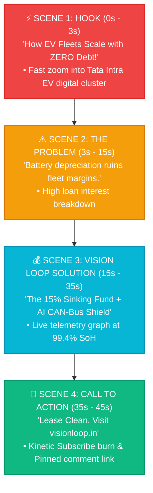

# VISION LOOP — YOUTUBE VIDEO PRODUCTION SPECIFICATIONS & MULTILINGUAL VOICE-OVER ENGINE
*Standard Operating Procedures (SOP) for Autonomous YouTube Shorts & Long-Form Video Production*

---

## 🎬 1. Production Format Comparison Matrix

| Technical Parameter | 📱 YouTube Shorts (`Laghu Vani Sentinel`) | 📺 YouTube Long-Form (`Dirgha Vani Sentinel`) |
| :--- | :--- | :--- |
| **Aspect Ratio** | **`9:16 Vertical`** | **`16:9 Widescreen Landscape`** |
| **Target Resolution** | **`1080 x 1920 (FHD Vertical)`** | **`3840 x 2160 (4K UHD Master)`** / `1920 x 1080` |
| **Frame Rate** | **`60 fps`** (Smooth motion) | **`60 fps`** (Cinematic fluid motion) |
| **Duration Range** | **`30 to 58 Seconds`** (Strictly <60s) | **`8 to 15 Minutes`** (480s to 900s for mid-rolls) |
| **Hook Window** | First **1.5 to 3.0 Seconds** | First **15 to 30 Seconds** |
| **Audio Loudness** | **`-14.0 LUFS`** (YouTube standard) | **`-14.0 LUFS`** (YouTube standard) |
| **Subtitles / CC** | Hardcoded Dynamic Kinetic Typography in lower 1/3 | Embedded Bilingual VTT Subtitles & On-screen Cards |
| **Color Space & LUT** | `Rec.709` / Electric Cyan High Contrast LUT | `Rec.709 / DCI-P3` / Cinematic Corporate Teal-Orange |
| **Primary Monetization** | YouTube Shorts Fund / Brand Deals / Link-in-Bio | Mid-Roll Google AdSense / Sponsor Integrations |
| **Statutory Tax Rule** | Zero-Rated Export of Services with LUT (SAC 998361) | Zero-Rated Export of Services with LUT (SAC 998361) |

---

## 🎙️ 2. Multilingual Voice-Over & Audio Parameters (India Focus)

All video audio tracks are normalized to **`-14.0 LUFS`** with a **`320 kbps AAC-LC`** stereo profile at **`48,000 Hz`** to prevent YouTube algorithmic compression artifacts.

### A. English (Indian Accent — `en-IN`):
* **Target Audience:** Institutional fleet buyers, SaaS clients, MNC logistics directors, green venture capital.
* **Neural Voice Profile:** Professional, clear, authoritative, authoritative tech-executive delivery.
* **Speaking Rate:** `0.98x` (Measured, articulate pacing).
* **Phonetic Tuning:** Exact pronunciation of Indian currency (*₹72,000 / Rupees Seventy-Two Thousand*, *Lakhs*, *Crores*) and transport codes (*SAC 997311*, *MSMED Act*).

### B. Hindi (`hi-IN`):
* **Target Audience:** Commercial fleet operators, regional logistics managers, transport contractors across UP, Delhi NCR, Bihar, and MP.
* **Neural Voice Profile:** Energetic, conversational, respectful, trustworthy Hindi voice (*Shuddh / Vyavaharik Hindi*).
* **Speaking Rate:** `1.05x` for Shorts, `0.98x` for Long-Form.
* **Script Localization:** Translates complex financial concepts into relatable terms (*Sinking Fund* -> *भविष्य का सुरक्षित रिप्लेसमेंट फंड*, *Zero Debt* -> *बिना किसी कर्ज़ या बैंक लोन के*).

---

## 📱 3. YouTube Shorts Storyboard Blueprint (9:16 Vertical)

---

## 📺 4. YouTube Long-Form Episodic Chapter Blueprint (16:9 4K)

Every long-form video is structured with **YouTube Timestamp Chapters** to maximize search discovery and viewer retention:

1. **Chapter 1 (00:00 - 01:00) — The Hook & Industry Landscape:**
   * Commercial EV expansion in India, operating margins, and the battery replacement dilemma.
2. **Chapter 2 (01:00 - 04:00) — The Statutory Tax Architecture:**
   * Invoicing under **SAC 997311** @ 18% GST (CGST ₹6,480 + SGST ₹6,480).
   * Claiming **100% Input Tax Credit (ITC)** under **Section 17(5)(a)** of the CGST Act.
3. **Chapter 3 (04:00 - 07:00) — The 15% Sinking Fund Mathematics:**
   * Liquid overnight treasury compound yield (~6.8% CAGR).
   * Accumulating ₹3.88 Lakhs by Month 36 for complete cash-funded vehicle replacement with zero loans.
4. **Chapter 4 (07:00 - 09:30) — Live Telematics & Standstill Safety Guardrail:**
   * CAN-Bus data stream, Tata OEM 70% DC fast charge warranty preservation, and speed == 0.0 km/h immobilizer verification.
5. **Chapter 5 (09:30 - 10:00) — Summary, Links & Telegram Bot Demo:**
   * Open architecture tour, website walkthrough, and call to subscribe.

---

## 🤖 5. Swarm Agent Personas & Invariant Validation

* 📱 **`YouTubeShortsProducerAgent` (Laghu Vani):** Enforces 9:16 vertical resolution, duration < 60s, and rapid hook pacing.
* 📺 **`YouTubeLongformDirectorAgent` (Dirgha Vani):** Enforces 16:9 4K resolution, duration >= 8 mins for mid-rolls, and chapter metadata.
* 🔍 **`ChiefAuditorVerificationAgent` (Chanakya):** Cross-examines all video proposals on aspect ratio framing, -14.0 LUFS loudness, dual English/Hindi localization, and **on-screen credential & PII blurring** before presenting to the Proprietor.

---

## 🔒 6. On-Screen Sensitive Data & Credential Blurring Protocol (DPDP Act 2023)

> ### ⚠️ MANDATORY PRODUCTION SAFETY DIRECTIVE:
> **All screen recordings, UI B-roll captures, accounting ledgers, and live code walkthroughs MUST apply an automated 25px Gaussian Blur filter over all sensitive credentials, government identifiers, and banking details.**

### A. Elements That MUST Be 100% Blurred / Masked in Videos:
1. **Proprietor Identifiers:** Permanent Account Number (`BGVPJ3356G`), 12-digit Aadhaar numbers, residential house numbers.
2. **Banking & Treasury Details:** Bank account numbers, IFSC codes, UPI VPA IDs, customer private balances, and payment gateway secret keys.
3. **API & Cloud Credentials:** Google App Passwords, GitHub Personal Access Tokens (PAT), MongoDB connection URIs with passwords, Telegram bot tokens.
4. **Vehicular & Driver PII:** Full Vehicle Identification Numbers (VIN chassis numbers), driver personal mobile numbers, and lessee signatory private contact details.

### B. What CAN Be Safely Displayed On-Screen:
* ✅ Trade Name: `Vision Loop`
* ✅ Official Badges: `INCOME_TAX_VERIFIED`, `UIDAI_OTP_VERIFIED`
* ✅ Masked Contract IDs: `VL-LEASE-2026-001`, `DL-01-EV-2026`
* ✅ Statutory Tax Classification: `SAC 997311 (18% GST)`
* ✅ Sinking Fund Percentages: `15.0% Automated Sweep`
* ✅ Telemetry Gauges: `SoC 92.5%`, `SoH 99.4%`, `Temp 33.5°C`, `Speed 0.0 km/h`

