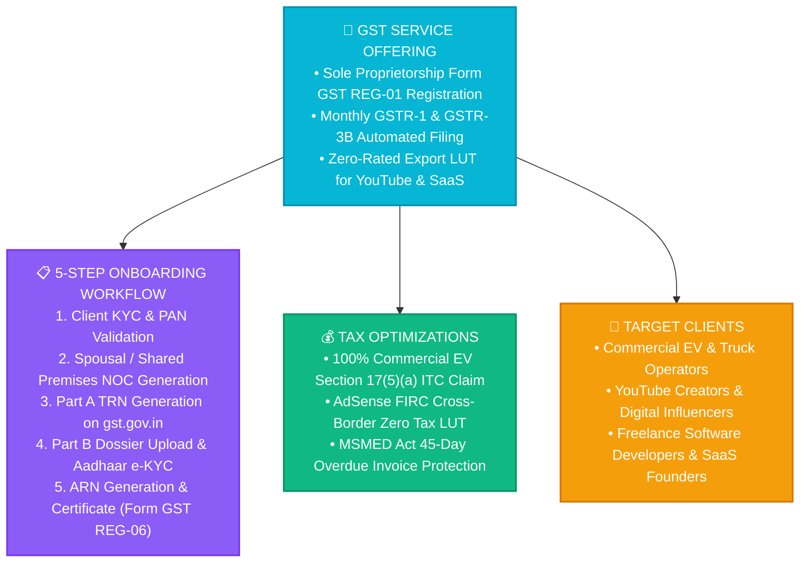

# VISION LOOP — SOLE PROPRIETORSHIP GST REGISTRATION & FILING AS A SERVICE
*Commercial Service Blueprint, Workflow Automation, Monthly Compliance & Creator Tax Optimization*

---

## 🏛️ 1. Service Overview & Commercial Classification

### Commercial Classification:
* **Service Name:** Vision Loop GST Compliance & Tax Strategy Suite
* **SAC Code:** **SAC 998311 / SAC 998314** (Tax Consultancy & Business Process Services)
* **GST Rate:** 18% GST (CGST 9% + SGST 9%)

---

## 📋 2. Step-by-Step GST Registration Service Package (Form GST REG-01)

### Phase 1: Client KYC & Document Assembly
1. **Proprietor Identity:** PAN card (`Individual - P`) + Aadhaar card linked with active mobile number.
2. **Business Address Proof:**
   * *Option A (Owned Property):* Electricity Bill / Property Tax Receipt in proprietor's name.
   * *Option B (Shared / Spousal Property without Rent):* **Consent Letter / No Objection Certificate (NOC)** executed by property owner + latest Electricity Bill.
3. **Bank Account Details:** Cancelled Cheque / Bank Statement with Proprietor's name and IFSC code (can be added within 30 days of registration).
4. **Passport Photo:** White background JPEG ($< 100\text{ KB}$).

### Phase 2: Part A — TRN Generation on `gst.gov.in`
1. Navigate to `https://www.gst.gov.in/` -> **Services** -> **Registration** -> **New Registration**.
2. Select **Taxpayer** -> State: `Uttar Pradesh (09)` -> District: `Lucknow`.
3. Legal Name as on PAN: `[Proprietor Full Name]`.
4. PAN Number: `[10-Digit PAN]`.
5. Enter Email and Mobile Number -> Verify Dual OTPs.
6. **Temporary Reference Number (TRN)** generated instantly.

### Phase 3: Part B — Detailed Dossier & SAC Code Mapping
1. Log in with TRN and Mobile OTP.
2. **Business Details Tab:**
   * Trade Name: `[Client Enterprise Name]`.
   * Constitution of Business: `Proprietorship`.
   * Reason for Registration: `Voluntary Basis` / `Inter-state Supply` / `Crossing Threshold`.
3. **Principal Place of Business Tab:**
   * Address geocoded to exact Google Map coordinates.
   * Nature of Possession: **Consent** (if using Spousal NOC) or **Rented** or **Owned**.
   * Upload Document 1: *Consent Letter (NOC)* (PDF $< 1\text{ MB}$).
   * Upload Document 2: *Latest Electricity Bill* (PDF $< 1\text{ MB}$).
   * Nature of Business Activity: `Leasing`, `Software`, `Digital Marketing`.
4. **Goods & Services (SAC / HSN Codes) Tab:**
   * Commercial Vehicle Lease: `SAC 997311`
   * Software & IT Services: `SAC 998314`
   * Digital Marketing & YouTube: `SAC 998361`
5. **Verification Tab:**
   * Check declaration box -> Authorized Signatory.
   * Submit with **Aadhaar e-KYC Authentication (EVC OTP)**.
   * **Application Reference Number (ARN)** dispatched within 15 minutes.
6. **GST Registration Certificate (Form GST REG-06)** issued within 3 to 7 working days.

---

## 💰 3. Flagship Service Pricing & Scope

| Service Package | Complete Deliverables | Pricing (INR) | Delivery Timeline |
| :--- | :--- | :--- | :--- |
| **Sole Proprietorship New GST Registration** *(Form GST REG-01)* | • Complete Form GST REG-01 Preparation on `gst.gov.in` • Custom Spousal / Shared Premises Consent NOC Drafting • Geocoded Principal Place of Business Address Mapping • Optimal SAC / HSN Code Strategic Selection • Aadhaar e-KYC EVC Authentication Assistance • End-to-End ARN Tracking until Form GST REG-06 Certificate is Issued | **₹1,999.00** *(All-inclusive One-time)* | **3 to 7 Working Days** |

---

## 🔒 4. Zero-Friction Proprietor Guarantee

* **No Physical Office Visit:** 100% digital portal execution via Aadhaar OTP.
* **No Expensive Commercial Rent Agreement Required:** Fully compliant using our custom Legal Consent NOC with property owner's electricity bill.
* **Statutory Compliance:** Form GST REG-06 Certificate issued directly to your official email.
