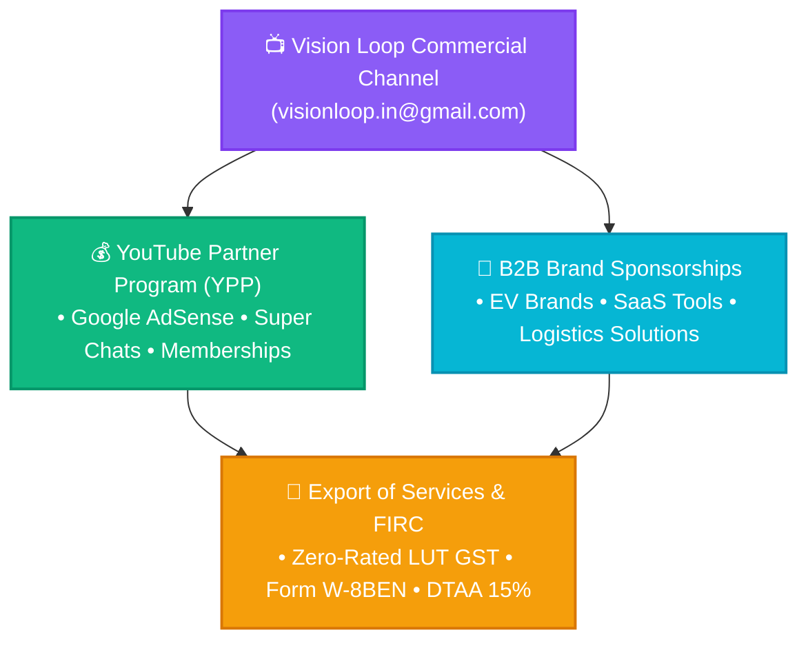

# VISION LOOP — COMMERCIAL YOUTUBE CHANNEL & DIGITAL MEDIA BLUEPRINT
*Institutional Strategy, Channel Branding, Google AdSense FIRC & Creator Monetization Framework*

---

## 🎥 1. Commercial Channel Architecture

---

## 🎨 2. Channel Identity & Brand Kit

* **Official Channel Name:** **Vision Loop** (*or Vision Loop Official*)
* **Primary Google Account:** **`visionloop.in@gmail.com`**
* **Handle:** `@VisionLoopOfficial` / `@VisionLoop`
* **Profile Avatar:** [`data/brand/avatar.png`](file:///d:/VisionLoop/data/brand/avatar.png) (3D Electric-Cyan Infinity Loop, 512x512)
* **Tagline:** *Autonomous Business Systems • Commercial EVs • Software Engineering*
* **Target Audience:** Entrepreneurs, software engineers, fleet managers, and creator-economy businesses in India and globally.

---

## 🎯 3. Content Pillars & Production Strategy

| Content Pillar | Video Topics & Format | Commercial Objective |
| :--- | :--- | :--- |
| **Pillar 1: Autonomous Enterprise & AI** | Building self-sustaining businesses with AI agent swarms, Docker microservices, Python SDKs, and automated workflows. | Drives SaaS sales for `visionloop-sdk` & enterprise consulting. |
| **Pillar 2: Commercial EV Fleet & Logistics** | Tata Intra EV real-world range/battery degradation tests, commercial lease economics, Indian logistics infrastructure, MSME schemes. | Generates fleet lessee leads & OEM EV brand sponsorships. |
| **Pillar 3: YouTube & Digital Marketing Strategy** | Channel monetization tactics, high-CPM video production, viral distribution formulas, and creator tax optimization. | Attracts digital marketing agency clients & creator consulting. |

---

## 💰 4. Three Revenue Streams & Banking Rails

1. **Google AdSense (YouTube Partner Program):**
   * Monthly international wire transfer from Google Asia Pacific Pte. Ltd. (Singapore) directly to the **Vision Loop Bank Current Account**.
   * Classified as **Export of Services** under Indian GST.
2. **Direct B2B Brand Sponsorships & Product Placements:**
   * Invoiced to Indian & international corporate sponsors under **SAC 998361 (18% GST)** with full B2B Input Tax Credit for sponsors.
3. **Affiliate & Software IP Licensing:**
   * Recurring SaaS referral revenue and direct developer sales of `visionloop-sdk` modular packages.
