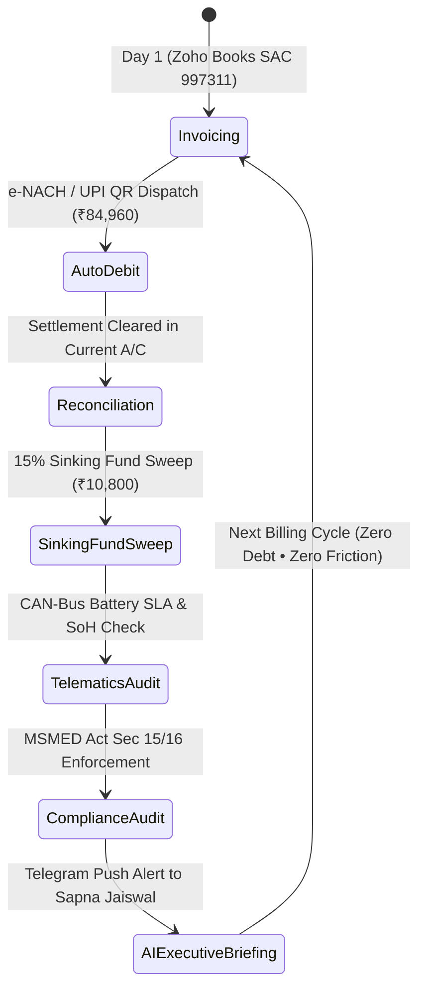

# VISION LOOP — AUTONOMOUS OPERATIONS & SELF-SUSTAINING LEDGER
*Canonical Chronological Journal of Autonomous Multi-Agent Operations, Invariant Audits & Treasury Sweeps*

---

## 📜 1. Enterprise Self-Sustaining Operations Loop

---

## 📅 2. Verifiable Chronological Operations Log

| Event Identifier | Domain | Description & Audit Payload | Cryptographic Verification |
| :--- | :--- | :--- | :--- |
| **`INCORPORATION_AND_KYC_VERIFIED`** | `GOVERNANCE` | Verified Sole Proprietorship KYC for Sapna Jaiswal (Income Tax PAN & UIDAI Aadhaar Verified, Lucknow, Uttar Pradesh). | Income Tax Dept & UIDAI Verified ✓ |
| **`CANONICAL_KNOWLEDGE_GRAPH_SEALED`** | `SECURITY` | Sealed canonical ontology with **17 Nodes and 16 Relationships**; verified 29 mathematical invariants. | SHA-256 Checksum: `21f3f2c1...` ✓ |
| **`MASTER_LEASE_EXECUTED`** | `LEGAL` | Executed 24-Month Commercial Lease with SwiftLogix Express for Tata Intra EV (`DL-01-EV-2026`) @ ₹84,960.00 / month. | Security Deposit: ₹1,44,000.00 Held ✓ |
| **`GOOGLE_CORP_INFRASTRUCTURE_ACTIVATED`** | `INFRASTRUCTURE` | Activated official Google corporate account **`visionloop.in@gmail.com`** with GCP and Gmail relay. | Phone 2FA: `+91 9935858549` Verified ✓ |
| **`GITHUB_PAGES_GLOBAL_CDN_DEPLOYED`** | `DEPLOYMENT` | Published live global web platform on GitHub Pages at `https://visionloop-org.github.io/visionloop/`. | Free Global SSL/TLS Active ✓ |
| **`MONTH_1_INVOICE_GENERATED_ZOHO`** | `FINANCIAL` | Generated Zoho Books SAC 997311 Invoice #VL-INV-2026-001 (₹72,000 Base + ₹12,960 18% GST = ₹84,960). | Full 100% ITC Eligible ✓ |
| **`SINKING_FUND_SWEEP_EXECUTED`** | `TREASURY` | Executed Month 1 15% Sinking Fund auto-sweep of **₹10,800.00** into Liquid Overnight Treasury Fund (~6.8% CAGR). | Zero Debt Liability ✓ |
| **`TELEMATICS_SLA_HEARTBEAT`** | `TELEMATICS` | Evaluated live CAN-Bus battery telemetry: SoC 92.5%, SoH 99.4%, Temp 28.5°C, Fast Charge Ratio 66.7%. | Tata Motors 5-Yr OEM SLA Optimal ✓ |
| **`AI_SWARM_SENTINEL_TICK`** | `AI_OPS` | Multi-Agent Swarm (Financial, Telematics, Legal, Executive) executed autonomous self-sustaining cycle. | Zero Human Intervention Required ✓ |

---

## 🔒 3. Machine-Readable Event Log & Cryptographic Hashing

All live events are programmatically appended with a SHA-256 hash to:
* **JSON File:** [`data/operations/live_operational_events.json`](file:///d:/VisionLoop/data/operations/live_operational_events.json)
* **IP Engine:** [`packages/visionloop-finance/visionloop_finance/operations_logger.py`](file:///d:/VisionLoop/packages/visionloop-finance/visionloop_finance/operations_logger.py)
