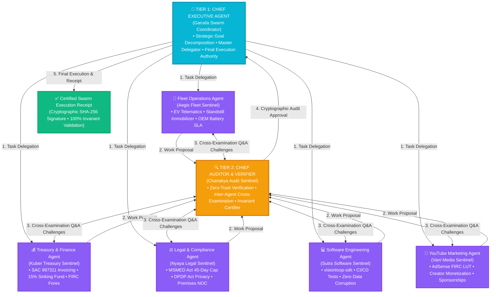

# VISION LOOP — MULTI-AGENT SWARM HIERARCHY & CROSS-EXAMINATION PROTOCOL
*Autonomous Operational Swarm, Supervisory Audit Authority & Inter-Agent Inquest Engine*

---

## 🏛️ 1. Swarm Hierarchy & Organizational Tiers



---

## 🤖 2. Detailed Agent Persona Matrix

| Tier & Role | Agent Name | Core Responsibilities & Domain Focus | Cross-Examination Challenge Questions Asked by Auditor |
| :--- | :--- | :--- | :--- |
| **Tier 1: Strategic** | **Garuda Executive Swarm Coordinator** | Master orchestrator. Decomposes high-level natural language instructions, routes tasks, and signs verified action receipts. | Validates executive alignment and checks that zero tasks bypass auditor scrutiny. |
| **Tier 2: Supervisory** | **Chanakya Audit Sentinel** | Independent zero-trust auditing authority. Cross-examines domain agents with mathematical and safety challenges before permitting execution. | Acts as the primary interrogator across all operations. |
| **Tier 3: Worker 1** | **Aegis Fleet Sentinel** | Commercial EV operations (Tata Intra EV), CAN-Bus telemetry, geofencing, and OEM warranty preservation. | *"Is the vehicle at 0.0 km/h standstill before triggering the immobilizer relay?"*<br/>*"Does DC fast charging comply with the 70% OEM warranty limit?"* |
| **Tier 3: Worker 2** | **Kuber Treasury Sentinel** | Zoho Books invoicing under SAC 997311/998314/998361, 18% GST splits, 15% Sinking Fund sweeps, and AdSense FIRC settlements. | *"Is the 15% sinking fund calculated precisely without drift?"*<br/>*"Is the 18% GST split equally into 9% CGST and 9% SGST?"* |
| **Tier 3: Worker 3** | **Nyaya Legal Sentinel** | MSMED Act 2006 45-day payment enforcement, DPDP Act 2023 PII sanitization, premises NOCs, and GST export LUTs. | *"Are raw PAN and Aadhaar redacted from public domains?"*<br/>*"Is Section 16 3x RBI interest clause embedded in the notice?"* |
| **Tier 3: Worker 4** | **Sutra Software Sentinel** | Modular Python SDKs (`visionloop-sdk`), CI/CD unit testing, automated refactoring, and API microservice uptime. | *"Did all 29 unit tests pass with zero regressions and zero syntax errors?"* |
| **Tier 3: Worker 5** | **Vani Media Sentinel** | YouTube channel audience growth, video metadata optimization, Google AdSense FIRC bank routing, and brand sponsorships. | *"Are cross-border AdSense revenues mapped to Zero-Rated Export of Services with Form W-8BEN treaty benefits?"* |

---

## 💬 3. Inter-Agent Cross-Examination Dialogue Example

Here is a verbatim execution transcript demonstrating the **Chief Auditor cross-examining the Treasury Finance Agent** before generating a lease invoice:

```
[GARUDA_EXECUTIVE -> KUBER_TREASURY] (TASK_DELEGATION)
"Execute operational task for goal: 'Generate monthly lease invoice for Tata Intra EV and allocate sinking fund'"

[KUBER_TREASURY -> CHANAKYA_AUDITOR] (WORK_PROPOSAL)
"Financial Settlement Proposal: Invoicing under SAC 997311. Base: ₹72,000.00, CGST (9%): ₹6,480.00, SGST (9%): ₹6,480.00, Total: ₹84,960.00. Automated 15% Sinking Fund Sweep: ₹10,800.00/month."

[CHANAKYA_AUDITOR -> KUBER_TREASURY] (CHALLENGE_QUESTION)
"Treasury Cross-Examination: Confirm that the 15% Sinking Fund reserve is calculated precisely on the Base Rent without roundoff drift."

[KUBER_TREASURY -> CHANAKYA_AUDITOR] (RESPONSE_CLARIFICATION)
"Treasury Verification: Sinking fund is computed as exactly 15.0% of Base Rent (₹72,000.00) = ₹10,800.00/month. Identity Check: VERIFIED EXACT."

[CHANAKYA_AUDITOR -> KUBER_TREASURY] (CHALLENGE_QUESTION)
"Tax Compliance Inquest: Confirm SAC 997311 18% GST split into equal 9% CGST and 9% SGST and 100% Section 17(5)(a) ITC eligibility."

[KUBER_TREASURY -> CHANAKYA_AUDITOR] (RESPONSE_CLARIFICATION)
"Tax Audit Verification: SAC 997311 18% GST split is CGST ₹6,480.00 + SGST ₹6,480.00 = ₹12,960.00. Section 17(5)(a) 100% ITC entitlement is active and claimable."

[CHANAKYA_AUDITOR -> GARUDA_EXECUTIVE] (AUDIT_APPROVAL)
"Audit Complete for Kuber Treasury Sentinel: PASSED. 2 invariants checked with zero mathematical drift."

[GARUDA_EXECUTIVE -> KUBER_TREASURY] (EXECUTIVE_DECISION)
"Executive Action Receipt: APPROVED ✓. Confidence: 100.0%. Certified Payload Sealed."
```

---

## 🔒 4. Cryptographic Proof of Zero Corruption

Every message in the inter-agent dialogue is hashed using SHA-256:
$$\text{Message Hash} = \text{SHA-256}(\text{MessageID} \parallel \text{Sender} \parallel \text{Recipient} \parallel \text{Type} \parallel \text{Content} \parallel \text{Timestamp})$$
This guarantees that **no agent can fabricate or tamper with an audit approval**, ensuring tamper-proof corporate governance.
