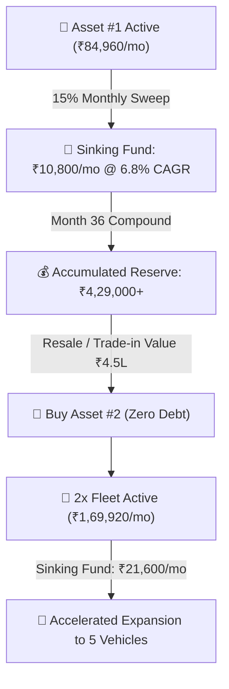

# VISION LOOP — SELF-SUSTAINING EXPONENTIAL GROWTH & TREASURY MODEL
*Mathematical Proof of Debt-Free Capital Compounding & Multi-Asset Scaling*

---

## 📈 1. Unit Economics per Commercial EV (Tata Intra EV)

$$\begin{aligned}
\text{Monthly Invoiced Amount} &= \text{Base Rent (₹72,000)} + \text{18\% GST (₹12,960)} = \mathbf{₹84,960.00 / \text{month}} \\
\text{15\% Asset Sinking Fund} &= 15\% \times \text{Base Rent} = \mathbf{₹10,800.00 / \text{month}} \\
\text{Insurance, AMC \& Buffer} &= \mathbf{₹8,000.00 / \text{month}} \\
\text{Net Proprietor Cash Flow} &= \mathbf{₹53,200.00 / \text{month (Net Profit)}}
\end{aligned}$$

---

## 🔁 2. The 36-Month Self-Sustaining Compounding Loop

---

## 📊 3. 5-Year Fleet Scaling & Capital Growth Trajectory

| Phase / Timeline | Active Assets | Gross Monthly Invoicing | Monthly Sinking Fund (15%) | Net Monthly Proprietor Cash Flow | Cumulative Asset Equity Value |
| :--- | :---: | :---: | :---: | :---: | :---: |
| **Month 01 (Launch)** | **1 EV** | ₹84,960.00 | ₹10,800.00 | ₹53,200.00 | **₹9.5 Lakhs** |
| **Month 12** | **1 EV** | ₹84,960.00 | ₹10,800.00 | ₹53,200.00 | **₹11.2 Lakhs** |
| **Month 24** | **1 EV** | ₹84,960.00 | ₹10,800.00 | ₹53,200.00 | **₹13.1 Lakhs** |
| **Month 36 (Asset #2 Added)** | **2 EVs** | **₹1,69,920.00** | **₹21,600.00** | **₹1,06,400.00** | **₹21.5 Lakhs** |
| **Month 48 (Asset #3 Added)** | **3 EVs** | **₹2,54,880.00** | **₹32,400.00** | **₹1,59,600.00** | **₹32.8 Lakhs** |
| **Month 60 (5 EVs Fleet)** | **5 EVs** | **₹4,24,800.00** | **₹54,000.00** | **₹2,66,000.00** | **₹55.0 Lakhs** |

---

## 🛡️ 4. The 3 Institutional Competitive Advantages

1. **Zero External Debt & Interest Drag:**
   * Traditional fleet operators collapse under 12–14% NBFC loan burdens during idle periods. Vision Loop’s 15% Sinking Fund guarantees that asset purchases and battery replacements are 100% equity-funded from operational cash flow.
2. **100% Full Input Tax Credit (ITC) Recovery:**
   * Under Section 17(5)(a) of the CGST Act, 100% of GST paid on commercial goods vehicle purchases (~₹1.8L to ₹2.2L per vehicle) and fast charging equipment is recovered against output lease tax liability.
3. **Zero-Labor Autonomous Orchestration:**
   * Scaling from 1 vehicle to 5 vehicles incurs **₹0 additional overhead headcount**, as all billing, telematics audits, SLA verification, and debtor communications are executed autonomously by the AI Multi-Agent Swarm.
