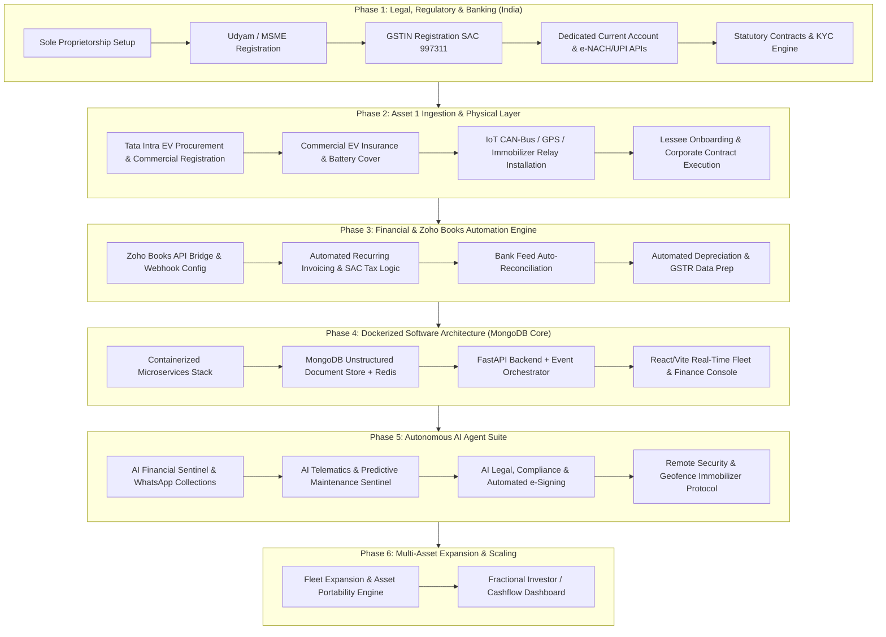
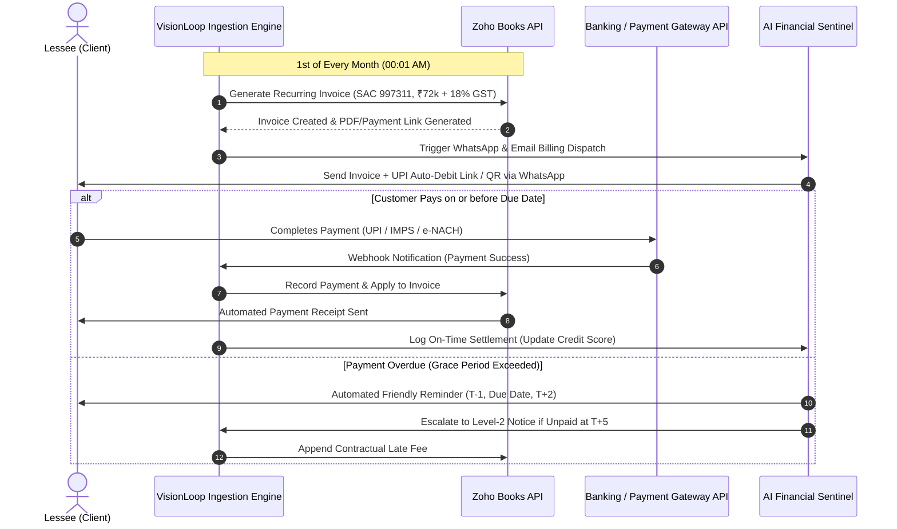

# Vision Loop — Autonomous Asset Rental Enterprise Master Plan
*Enterprise Blueprint: From Indian Incorporation to AI-Orchestrated Multi-Asset Operations*

---

## 1. Executive Summary & Vision

**Vision Loop** is conceived as a **next-generation, fully autonomous Sole Proprietorship asset rental company** operating in India, owned by **Sapna Jaiswal** (PAN: `BGVPJ3356G`) with headquarters and primary base operations in **Lucknow, Uttar Pradesh**. By fusing physical asset leasing with hyper-automated digital operations, Vision Loop eliminates traditional administrative friction, minimizes human operational overhead, and maximizes capital velocity.

### Initial Launch Target
* **Primary Initial Asset:** Commercial Electric Vehicle — **Tata Intra EV** (Yellow Board `DL-01-EV-2026`).
* **Monthly Revenue Target:** **₹72,000 + 18% GST (SAC 997311) = ₹84,960.00 / month** per vehicle on a long-term commercial lease with SwiftLogix Express.
* **Base Operating Hub:** Lucknow, Uttar Pradesh (Freight Corridors: Lucknow – Kanpur – Delhi NCR).
* **Core Tech Backbone:** Full-stack containerized architecture (**Docker Compose**) integrating **MongoDB 7.0**, **Zoho Books APIs**, **IoT CAN-Bus Telematics**, **AI Agent Swarm**, and **Telegram Mobile Command Bot (@VisionLoop_Bot)**.
* **Live Web Platform:** [https://visionloop-org.github.io/visionloop/](https://visionloop-org.github.io/visionloop/)

---

## 2. Why an Unstructured Document Database (MongoDB)?

To enable frictionless scaling across heterogeneous asset types, Vision Loop utilizes an **Unstructured Document Store (MongoDB)** rather than a rigid relational schema:

1. **Asset Polymorphism & Extensibility:** An EV truck (Tata Intra EV) carries parameters like `battery_capacity_kwh`, `charging_standard`, and `cell_voltages`, while industrial machinery, cold storage units, or camera kits carry entirely different attributes. A document store accommodates any asset without database migrations.
2. **High-Frequency IoT & CAN-Bus Telemetry:** Vehicle CAN-Bus telemetry emits nested arrays of sensor data, GPS coordinates, and diagnostic trouble codes (DTCs) that serialize natively into BSON documents with sub-millisecond ingest speeds.
3. **AI Agent JSON Memory:** Multi-agent LLM reasoning traces, dynamic tool outputs, WhatsApp conversational trees, and KYC audit trails are inherently nested JSON trees stored without loss of fidelity.
4. **Zoho Books API Ingestion:** Inbound webhooks, recurring invoice line items, and bank transaction receipts are natively deep JSON payloads stored in queryable BSON format.

---

## 3. Phased Roadmap Overview



---

## 4. Detailed Phase Breakdown

### Phase 1: Indian Legal Incorporation, Regulatory & Banking Setup

| Item | Requirement / Action Item | Statutory / Operational Impact |
| :--- | :--- | :--- |
| **Legal Entity** | Sole Proprietorship under Trade Name **"Vision Loop"** | Low compliance cost, complete owner control, single-PAN linkage. |
| **Udyam (MSME)** | Register on Udyam portal under Service Sector (Rental/Leasing of Machinery/Equipment/Vehicles). | Priority sector lending, MSMED Act 45-day payment statutory protection, lower trademark fees. |
| **GSTIN Registration** | Mandatory for inter-state & commercial B2B rental operations. | **SAC Code: 997311** (Leasing or rental services of transport vehicles without operator) or **SAC 9966**.<br>Applicable GST: 18% (allows Full Input Tax Credit (ITC) claiming on asset purchase/charging/maintenance). |
| **Local Registrations** | Shop & Establishment Registration (State specific) + Professional Tax (if applicable). | Required for bank verification and municipal compliance. |
| **Banking Setup** | Dedicated Current Account (e.g., ICICI/HDFC/RazorpayX) with Open API / Webhook access. | Enables auto-debit (e-NACH mandates), automated reconciliation, and instant payout rails. |
| **Legal Templates** | Master Commercial Asset Lease Agreement + e-Sign integration. | Comprehensive indemnification, default clauses, battery degradation norms, territorial boundaries, and remote immobilization consent. |

---

### Phase 2: Asset #1 Ingestion (Tata Intra EV Commercial Vehicle)

#### 1. Vehicle Procurement & Commercial Setup
* **Model:** Tata Intra EV (or comparable commercial EV pickup/van).
* **Registration:** Commercial Yellow Board (Goods Carriage).
* **Taxation & Subsidies:** Leverage state EV road tax exemptions and FAME-II/State EV policy subsidies.
* **Insurance:** Commercial Multi-Year Comprehensive Coverage with **Return to Invoice (RTI)**, **Zero Depreciation**, and **Dedicated Battery Pack Protection**.

#### 2. Telematics & Hardware Interfacing (IoT Layer)
* **GPS + 4G OBD-II / CAN-Bus Telematics:** Live streaming of Battery SoC (%), Range, Speed, Odometer, Battery Temperature, and Diagnostic Trouble Codes (DTC).
* **Remote Immobilization Relay:** Connected to vehicle ignition / controller circuit for emergency cut-off in case of geo-breach or non-payment default.
* **Geo-Fencing:** Pre-configured bounding boxes (e.g., City logistics perimeter: NCR, MMR, Bengaluru, etc.).

#### 3. Monthly Financial Unit Economics (Asset 1)
$$\begin{aligned}
\text{Gross Monthly Billing} &= ₹72,000 \\
\text{GST @ 18\%} &= ₹12,960 \\
\mathbf{\text{Total Monthly Invoiced}} &= \mathbf{₹84,960} \\
\text{Estimated OpEx (Insurance amort., Telematics SIM, Cloud, AMC Reserve)} &\approx ₹7,500 \\
\mathbf{\text{Net Pre-Tax Operating Cash Flow (unleveraged)}} &\approx \mathbf{₹64,500 \text{ / month}}
\end{aligned}$$

---

### Phase 3: Zoho Books Financial & Compliance Automation



---

### Phase 4: Full-Stack Dockerized Infrastructure

The entire platform runs in an isolated, multi-container Docker environment with an **Unstructured Document Database (MongoDB 7.0)**.

```
d:\VisionLoop\
├── docker-compose.yml              # Multi-container orchestration (MongoDB + Redis + Apps)
├── .env.example                    # Secrets & API credentials template
├── plan.md                         # Enterprise master roadmap
│
├── services/
│   ├── core-api/                   # FastAPI backend (Motor Async MongoDB + REST)
│   │   ├── Dockerfile
│   │   ├── app/
│   │   │   ├── main.py
│   │   │   ├── database.py         # MongoDB connection & collection getters
│   │   │   ├── api/                # Endpoints (assets, leases, invoices, telematics)
│   │   │   ├── schemas/            # Pydantic v2 validation models
│   │   │   └── config.py
│   │   └── requirements.txt
│   │
│   ├── ai-agent-service/           # AI Autonomous Engine (LLM Multi-Agent System)
│   │   ├── Dockerfile
│   │   ├── app/
│   │   │   ├── agents/
│   │   │   │   ├── financial_agent.py   # Invoicing, collections, dynamic payment reminders
│   │   │   │   ├── telematics_agent.py  # Anomaly detection, battery SOH, maintenance scheduling
│   │   │   │   ├── legal_agent.py       # Contract drafting, KYC verification, compliance check
│   │   │   │   └── executive_agent.py   # Daily/Weekly business summary & autonomous decisions
│   │   │   └── main.py
│   │   └── requirements.txt
│   │
│   ├── telematics-listener/        # Real-time IoT Ingestion Worker (CAN-Bus / GPS)
│   │   ├── Dockerfile
│   │   ├── app/
│   │   │   ├── simulator.py        # Vehicle movement & battery drain simulation
│   │   │   └── main.py
│   │   └── requirements.txt
│   │
│   ├── zoho-connector/             # Dedicated Zoho Books Sync Service
│   │   ├── Dockerfile
│   │   ├── app/
│   │   │   ├── client.py           # Zoho Books API wrapper (Invoices, Customers, Payments)
│   │   │   ├── tax_rules.py        # SAC 997311 / 9966 GST computation engine
│   │   │   └── main.py
│   │   └── requirements.txt
│   │
│   └── dashboard-ui/               # Modern Glassmorphic Admin Console (React + Vite)
│       ├── Dockerfile
│       ├── src/
│       │   ├── App.jsx             # Real-time asset telemetry & Zoho billing overview
│       │   └── index.css           # Premium dark-mode styling system
│       └── package.json
│
└── config/                         # Configuration schemas and database init
    ├── init-mongo.js               # MongoDB bootstrap script (collections, indexes, seed data)
    ├── legal/                      # Master Lease Agreement & Indemnity templates
    └── compliance/                 # Udyam, GSTIN, Shop Act guidelines & checklists
```
